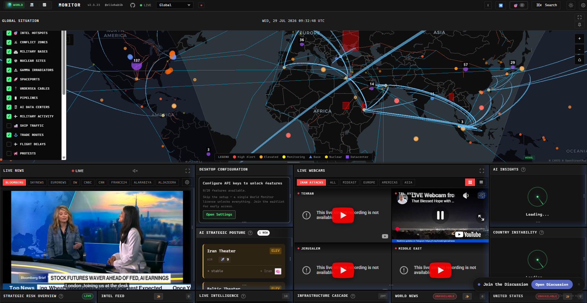

# 🌍 World Monitor - Complete Installation Guide (Ubuntu)

> 🚀 A step-by-step guide to install and run **World Monitor** from the GitHub source code on Ubuntu.



## 🌍 What is World Monitor?

**World Monitor** is an open-source, self-hosted platform designed to provide real-time monitoring and visualization of global events and data. It allows users to track live information through an interactive dashboard while maintaining full control over deployment and data. Since it is open source, developers can inspect the source code, customize features, contribute improvements, and deploy it on their own infrastructure such as a local machine, virtual machine, or cloud server. It is suitable for both learning purposes and production deployments, making it a flexible choice for developers, homelab enthusiasts, and organizations.

## 📋 System Requirements

Before starting, make sure your system meets these requirements:

- ✅ Ubuntu 22.04 / 24.04 LTS
- ✅ Internet Connection
- ✅ Git
- ✅ Node.js 22 LTS
- ✅ npm
- ✅ Minimum 2 GB RAM (4 GB Recommended)
- ✅ At least 2 GB Free Disk Space

---

## 📦 Step 1 - Update Ubuntu

Update your package list and install the latest security updates.

```bash
sudo apt update && sudo apt upgrade -y
```

---

## 🔧 Step 2 - Install Required Packages

Install Git, Curl and Build Tools.

```bash
sudo apt install git curl build-essential -y
```

These packages are required for:

- 📥 Git → Download the project
- 🌐 Curl → Download Node.js installer
- 🛠️ Build Essentials → Compile native npm packages

---

## 🟢 Step 3 - Install Node.js 22 LTS

Add the official NodeSource repository.

```bash
curl -fsSL https://deb.nodesource.com/setup_22.x | sudo -E bash -
```

Install Node.js.

```bash
sudo apt install -y nodejs
```

---

## ✅ Step 4 - Verify Installation

Check installed versions.

```bash
node -v
npm -v
git --version
```

Expected Output (Versions may differ)

```text
node v22.x.x
npm 10.x.x
git version 2.x.x
```

---

## 📥 Step 5 - Clone the Repository

Download the source code.

```bash
git clone https://github.com/koala73/worldmonitor.git
```

Move inside the project.

```bash
cd worldmonitor
```

---

## 📦 Step 6 - Install Dependencies

Install all required Node.js packages.

```bash
npm install --verbose
```

> 💡 The first installation may take a few minutes depending on your internet speed.

---

## 🚀 Step 7 - Start Development Server

Run the application.

```bash
npm run dev -- --host
```

If everything is successful, you should see something similar to:

```text
VITE v6.x.x ready

Local:
http://localhost:3000/

Network:
http://192.168.x.x:3000/
```

---

## 🌐 Step 8 - Open in Browser

If using Ubuntu Desktop:

```
http://localhost:3000
```

If using VMware, VirtualBox or another computer on the same network:

```
http://YOUR_SERVER_IP:3000
```

Example

```
http://192.168.29.105:3000
```

---

## 🖥️ Find Your Server IP

```bash
hostname -I
```

or

```bash
ip addr
```

---

## 📁 Project Structure

```
worldmonitor/
│
├── src/
├── public/
├── package.json
├── vite.config.*
├── node_modules/
└── ...
```

---

## ⚠️ Common Issues

### ❌ npm: command not found

Install Node.js correctly.

---

### ❌ vite: not found

Dependencies were not installed.

Run:

```bash
npm install
```

---

### ❌ Connection Refused

Run Vite using:

```bash
npm run dev -- --host
```

---

### ❌ Browser doesn't open automatically

Ubuntu Server does not include a GUI browser.

This message is normal:

```
spawn xdg-open ENOENT
```

It does **NOT** affect the application.

Simply open the URL manually.

---

### ❌ Port Not Accessible

Check if Vite is listening.

```bash
ss -tulpn | grep 3000
```

---

## 🔥 Firewall (If Needed)

Check firewall status.

```bash
sudo ufw status
```

Allow port 3000.

```bash
sudo ufw allow 3000/tcp
```

---

## 🔄 Updating the Project

```bash
git pull

npm install

npm run dev -- --host
```

---

## 🧹 Remove the Project

```bash
rm -rf worldmonitor
```

---

## 💡 Development vs Production

### Development

```bash
npm run dev -- --host
```

Used for:

- Feature development
- Testing
- Debugging

---

### Production

Usually you'll build the project first.

```bash
npm run build
```

Then start the production server according to the project's documentation.

---

## 📚 Useful Commands

### Update Ubuntu

```bash
sudo apt update && sudo apt upgrade -y
```

### Install Packages

```bash
sudo apt install git curl build-essential -y
```

### Install Node.js

```bash
curl -fsSL https://deb.nodesource.com/setup_22.x | sudo -E bash -
sudo apt install -y nodejs
```

### Verify Installation

```bash
node -v
npm -v
git --version
```

### Clone Repository

```bash
git clone https://github.com/koala73/worldmonitor.git
cd worldmonitor
```

### Install Dependencies

```bash
npm install --verbose
```

### Run Application

```bash
npm run dev -- --host
```

---

## ❤️ Support

If this guide helped you, don't forget to:

⭐ Star the GitHub Repository

👍 Like the video

🔔 Subscribe for more DevOps & Self-Hosting tutorials

Happy Learning! 🚀
