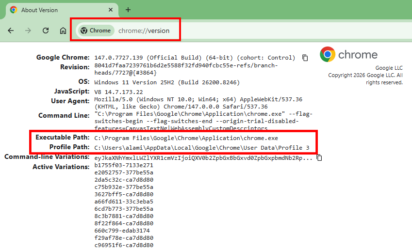

# 🚀 Chrome Multi-Profile Launcher

Launch Multiple Google Chrome Profiles Instantly Using A Simple Batch Script.

---

## ✨ Features

- ✅ Open Multiple Chrome Profiles In One Click
- ✅ Beginner Friendly
- ✅ Easy To Edit And Customize
- ✅ Lightweight BAT Script
- ✅ Useful For Multi-Account Users
- ✅ Works On Windows 10 & Windows 11

---

## 📜 Batch Script

```bat
@echo off

:: ============================================
:: Created By TechnoSnag
:: YouTube - https://www.youtube.com/@TechnoSnag
:: ============================================

title Chrome Multi-Profile Launcher

:: Default Profile
start "" "C:\Program Files\Google\Chrome\Application\chrome.exe" --profile-directory="Default"

:: JasonBrowdyGaming
start "" "C:\Program Files\Google\Chrome\Application\chrome.exe" --profile-directory="Profile 14"

:: Tiny Pirate
start "" "C:\Program Files\Google\Chrome\Application\chrome.exe" --profile-directory="Profile 18"

exit
```

---

## 🧠 Script Explanation

- `@echo off` → Hide Command Output For Cleaner Execution
- `title Chrome Multi-Profile Launcher` → Set Custom CMD Window Title
- `start ""` → Launch A New Chrome Window
- `"chrome.exe"` → Google Chrome Application Path
- `--profile-directory="Default"` → Open Default Chrome Profile
- `--profile-directory="Profile 14"` → Open Specific Chrome Profile, Change as Per Your Need
- `:: Comment Text` → Used For Labels And Better Readability
- `exit` → Close CMD Window Automatically

> <mark>Note: A Chrome default profile is the **initial user profile directory (named "Default") created automatically when Chrome is installed.**</mark>

---

# 🔍 How To Find Your Chrome Profile Name

## 🟢 Step 1 — Open Chrome Version Page

Paste This URL Into Chrome:

```text
chrome://version
```

> <mark>**You Will Find Your `Profile Name With Path Here`**</mark>

Example Screenshot:

## 

## 🟢 Step 2 — Find Profile Path

You Will See Something Like This:

```text
Profile Path:
C:\Users\YOUR_USERNAME\AppData\Local\Google\Chrome\User Data\Default
```

📌 The Last Folder Name Is Your Profile Name.

Example:

```text
Default
```

Or:

```text
Profile 14
```

---

## 🟢 Step 3 — View All Chrome Profiles

Now Go One Step Back From:

```text
...\Google\Chrome\User Data\
```

There You Will See All Chrome Profiles:

```text
Default
Profile 1
Profile 2
Profile 14
Profile 18
```

Use These Folder Names Inside The Script.

---

# 💾 How To Save and Run The Script

## 📝 Follow Below Steps:

1. Open **Notepad**
2. Paste The Script
3. Click: File → Save As
4. Save File As: chrome-profiles.bat
5. Change Save Type To: All Files
6. Double Click The `BAT` File To Run 🚀

---

# 📌 Notes

- ⚠️ Google Chrome Must Be Installed In Default Location
- ⚠️ Profile Names May Be Different On Your PC
- ⚠️ You Can Add Unlimited Profiles
- ⚠️ Edit Profile Numbers Based On Your System

---

# ❤️ Support

If This Project Helped You, Consider Supporting The Channel.

🎥 YouTube: https://www.youtube.com/@TechnoSnag

---
